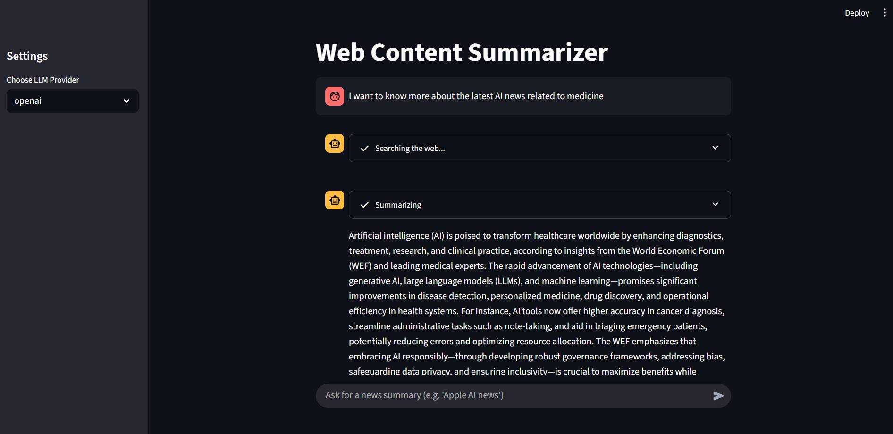

# Web Scraper & Summarizer

## Overview


This project is a Python-based web scraping and summarization tool with a user-friendly web interface. It automates the process of searching for news articles or other types of webpages, scraping their content, and generating concise summaries using either OpenAI or Ollama (Llama3.2 - Local) language models. The main way to use the tool is through an interactive Streamlit app, making it easy to search and summarize news directly from your browser. The tool is modular, allowing for easy extension and customization.


## Features
- **Web Interface:** Search and summarize news or web content using a simple chat-like interface powered by Streamlit.
- **Automated Web Search:** Uses the Brave Search API to find relevant website pages based on a user query.
- **Web Scraping:** Extracts content (titles, paragraphs, headings, links, etc.) from the resulting web pages using Selenium and BeautifulSoup.
- **Summarization:** Summarizes the scraped content using either OpenAI or Ollama (Llama3.2) models, depending on your configuration.


## File Structure
- `interface.py` — Main entry point for the web interface (Streamlit app).
- `Brave.py` — Handles Brave Search API integration.
- `Scraper.py` — Contains the web scraping logic.
- `Agent.py` — Summarizes text using OpenAI or Ollama (replaces the previous Summarizer class).
- `requirements.txt` — Python dependencies.
- `cli.py` — (Optional) CLI entry point for running the summarizer from the command line.
- `.env` — Store your API keys and environment variables here (see below).


## Setup Instructions

1. **Clone the repository and install dependencies:**
   ```sh
   pip install -r requirements.txt
   ```

2. **Configure API Keys:**
   - Create a `.env` file in the project root (if not present).
   - Add your API keys as follows:
     ```env
     BRAVE_API_KEY="your_brave_api_key_here"
     OPENAI_API_KEY="your_openai_api_key_here"
     ```
   - These keys are required for the Brave Search API and OpenAI summarization provider. The program loads them automatically from the `.env` file.

3. **Run the Web Interface:**
   ```sh
   streamlit run interface.py
   ```
   - This will launch the Streamlit app in your browser. Enter your news topic or question in the chat input to get a summary of the latest news.

   **Example:**
   - Type: `I want to know more about the latest AI news related to medicine` in the chat box and press Enter.
   
   

---

**(Optional) Command-Line Usage:**

You can also run the summarizer from the command line using `main.py`:
```sh
python main.py -p <provider> <search_query>
```
Where `<provider>` is either `openai` or `ollama`, and `<search_query>` is your topic or keywords.

## Notes
- The `.env` file is included in `.gitignore` and should **not** be committed to version control.
- You can switch between OpenAI and Ollama summarization by changing the provider in the Streamlit sidebar.
- The summarizer will print a concise summary of the top search results for your query in the web interface. 
